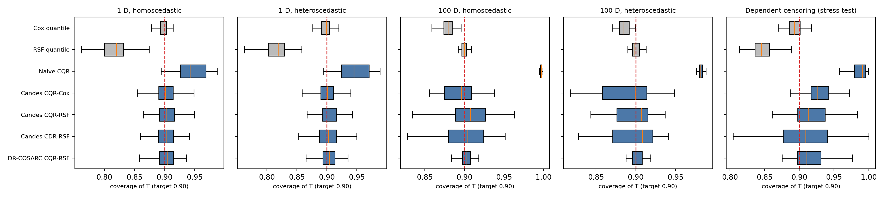

# conformal-survival

Distribution-free **lower prediction bounds for survival times** under censoring,
in Python.

Given any survival model (Cox, random survival forest, ...), `conformal-survival`
returns for each new individual a bound $\hat L(x)$ such that

$$\mathbb{P}\big(T \ge \hat L(X)\big) \ge 1 - \alpha,$$

where $T$ is the *uncensored* survival time. "With 90% probability this patient
survives at least $\hat L(x)$ days." The guarantee does not rely on the survival
model being correct.

It implements two published methods. As far as I could find, there was no Python
implementation of either; the authors' reference code is in R.

| Estimator | Data required | Paper |
|---|---|---|
| `ConformalSurvivalLPB` | Type-I censoring: censoring time $C$ known for **every** unit (e.g. administrative end of follow-up) | Candès, Lei & Ren (2023), *Conformalized survival analysis*, JRSS-B ([arXiv:2103.09763](https://arxiv.org/abs/2103.09763)); R: [`cfsurvival`](https://github.com/zhimeir/cfsurvival) |
| `DRConformalSurvivalLPB` | Ordinary right-censored data $(X, \min(T,C), \mathbb 1\{T \le C\})$ | Sesia & Svetnik (2025), *Doubly robust conformalized survival analysis with right-censored data*, ICML ([arXiv:2412.09729](https://arxiv.org/abs/2412.09729)); R: [`conformal_survival`](https://github.com/msesia/conformal_survival) |

## Example

```python
import numpy as np
from sksurv.ensemble import RandomSurvivalForest
from conformal_survival import DRConformalSurvivalLPB
from conformal_survival.simulate import simulate

train = simulate("uvt_hetero", n=2000, random_state=0)   # right-censored data
test = simulate("uvt_hetero", n=2000, random_state=1)

lpb = DRConformalSurvivalLPB(
    RandomSurvivalForest(n_estimators=100, min_samples_leaf=20, random_state=0),
    alpha=0.1,          # target: P(T >= L(X)) >= 90%
    c0="auto",          # censoring threshold chosen on the training fold
    random_state=0,
).fit(train.X, train.time, train.event)

L = lpb.predict(test.X)
print(f"coverage of the true survival time: {np.mean(test.T >= L):.3f}")   # 0.905
```

Any estimator with the scikit-survival interface works as the survival or censoring
model: `fit(X, y)` with a structured `y` (`event`, `time`), and
`predict_survival_function(X)`.

## How it works

**The censoring problem.** We never see $T$ for censored units, only
$\tilde T = \min(T, C)$. Calibrating on $\tilde T$ is valid but uselessly
conservative, because $\tilde T \le T$. Without extra assumptions, nothing better is
possible (Candès et al., Theorem 1).

**The trick (Candès, Lei & Ren).** Fix a threshold $c_0$ and keep only units with
$C \ge c_0$. For them, $\tilde T \wedge c_0 = T \wedge c_0$ is fully observed.
Selecting on $C \ge c_0$ changes the population. But under conditionally independent
censoring ($T \perp C \mid X$), it changes **only the distribution of $X$**, with
likelihood ratio

$$\frac{dP_X}{dP_{X \mid C \ge c_0}}(x) \propto \frac{1}{\mathbb P(C \ge c_0 \mid X = x)}.$$

That is a pure covariate shift, so **weighted split conformal inference**
(Tibshirani et al., 2019) recovers a valid bound for $T \wedge c_0$, and therefore
for $T$:

1. Split the data into training and calibration folds. Fit a survival model and a
   censoring model $\hat c(x) \approx \mathbb P(C \ge c_0 \mid x)$ on the training fold.
2. On calibration units with $C_i \ge c_0$, compute conformity scores, e.g.
   $V_i = \hat q_\alpha(X_i) \wedge c_0 - \tilde T_i \wedge c_0$ (CQR), with weights $W_i = 1/\hat c(X_i)$.
3. For a test point, $\eta(x)$ is the $(1-\alpha)$ quantile of
   $\sum_i p_i(x)\,\delta_{V_i} + p_\infty(x)\,\delta_{+\infty}$, with
   $p_i \propto W_i$ and $p_\infty \propto 1/\hat c(x)$.
4. Output $\hat L(x) = \big(\hat q_\alpha(x) \wedge c_0 - \eta(x)\big) \wedge c_0$.

If $\hat c$ is the true censoring probability, coverage holds **exactly in finite
samples**. With estimated $\hat c$ it is **doubly robust**: approximately valid if
*either* the censoring model *or* the survival quantiles are estimated well.

**Right censoring (Sesia & Svetnik).** Usually $C$ is only observed for censored
units. For units with an event, $C > T$ is unknown, so it is *imputed* by drawing
from the censoring model conditional on $C > \tilde T_i$:
$S_C(\hat C_i \mid X_i) = U \cdot S_C(\tilde T_i \mid X_i)$, $U \sim \mathrm{Unif}(0,1)$.
The type-I procedure then runs on the imputed data, and the bound is capped at the
survival model's own $\alpha$-quantile, which restores double robustness.

**Choosing $c_0$.** Larger $c_0$ means less censoring loss but fewer calibration
units and more extreme weights. With `c0="auto"`, $c_0$ is chosen on the training
fold only, by maximizing the mean bound on a holdout split, so the calibration fold
stays untouched (Candès et al., Section 3.3).

## Validation

`pytest` checks, among other things:

- The weighted quantile matches its definition on 200 random cases (including
  ties), and reduces to the usual $\lceil (n+1)(1-\alpha) \rceil$ conformal rank
  without weights.
- Censoring-time imputation recovers the right conditional law (KS test against the
  memoryless exponential).
- Coverage reaches the target over repeated simulations with a deliberately wrong
  survival model, for both score types and both methods.
- **Negative control:** in a strong covariate-shift setting, dropping the weights
  pulls coverage well below target, so the coverage tests can detect a wrong method.

### Simulation study

`experiments/coverage.py` follows the design of Candès et al. (Section 4): train on
n = 3,000, test on 3,000 fresh units, target 90% coverage of the **uncensored** $T$,
100 replications per setting. "shift" is an added stress test where censoring depends
strongly on $X$. Censoring rates are 84–88%.

Mean coverage (target 0.90). The 1-D and dependent-censoring settings use 100
replications each. The 100-D settings use 20 replications and 100-tree forests to keep
run time reasonable, so their standard error is about 0.009.

| Method | 1-D homosc. | 1-D heterosc. | Dependent censoring | 100-D homosc. | 100-D heterosc. |
|---|---|---|---|---|---|
| Cox quantile (uncalibrated) | 0.897 | 0.898 | 0.893 | 0.879 | 0.885 |
| RSF quantile (uncalibrated) | 0.817 | 0.814 | 0.847 | 0.900 | 0.899 |
| Naive CQR on $\tilde T$ | 0.945 | 0.945 | 0.985 | 0.997 | 0.982 |
| Candès CQR, Cox | 0.902 | 0.901 | 0.929 | 0.891 | 0.889 |
| Candès CQR, RSF | 0.904 | 0.905 | 0.914 | 0.898 | 0.894 |
| Candès CDR, RSF | 0.902 | 0.902 | 0.905 | 0.895 | 0.894 |
| DR-COSARC CQR, RSF (right-censored only) | 0.902 | 0.903 | 0.915 | 0.902 | 0.902 |

In the low-dimensional settings, the conformal methods hit the target while the
uncalibrated random survival forest under-covers. The naive approach covers, but only
because its bounds collapse: its median ratio of bound to true quantile is 0.00–0.22,
against 0.80–1.04 for the conformal methods (`results/efficiency.png`).

With 100 covariates, the type-I methods come in slightly under target (0.889–0.898,
within about 1.2 standard errors). That is consistent with the theory: coverage is
exact only with known weights, and here the weights come from a Cox censoring model
fitted on 100 covariates, which is noisy, even though censoring is in fact independent
of X. Swapping in a Kaplan–Meier censoring model, which is correct here, should restore
exactness; that run has not been done yet.



### Real data

`experiments/real_data.py` uses GBSG2 (686 breast-cancer patients, 56% censored)
over 50 random train/test splits. Coverage is estimated by inverse probability of
censoring weighting (IPCW):

| Method | IPCW coverage | Median bound (days) |
|---|---|---|
| Cox quantile (uncalibrated) | 0.886 | 416 |
| DR conformal, Cox | 0.906 | 396 |
| DR conformal, RSF | 0.918 | 422 |

## Install

```bash
pip install -e .              # core: numpy, scipy, scikit-learn
pip install -e ".[sksurv]"    # + scikit-survival models
```

On Apple-silicon Macs without a C compiler, scikit-survival's `ecos` dependency
fails to build. scikit-survival's Cox and forest models don't need it:

```bash
pip install numexpr osqp joblib pandas && pip install --no-deps scikit-survival
```

## Status and roadmap

- [x] Type-I method (CQR and CDR scores), fixed or data-driven $c_0$
- [x] Right-censored DR method, fixed cutoff
- [x] Simulation study harness
- [ ] Adaptive cutoffs (Gui, Hore, Ren & Barber, 2024)
- [x] Real-data example (GBSG2)
- [ ] Documentation site, PyPI release

## References

- Candès, E. J., Lei, L., & Ren, Z. (2023). Conformalized survival analysis. *JRSS-B*, 85(1), 24–45.
- Sesia, M., & Svetnik, V. (2025). Doubly robust conformalized survival analysis with right-censored data. *ICML*.
- Tibshirani, R. J., Foygel Barber, R., Candès, E., & Ramdas, A. (2019). Conformal prediction under covariate shift. *NeurIPS*.
- Romano, Y., Patterson, E., & Candès, E. (2019). Conformalized quantile regression. *NeurIPS*.
